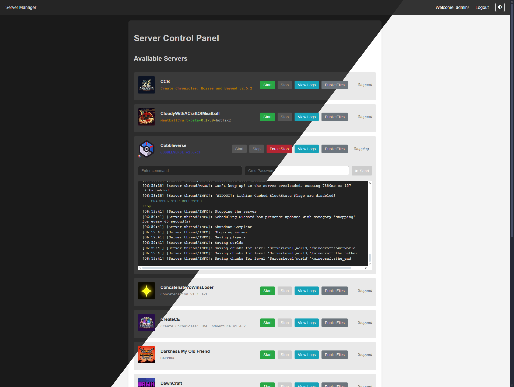

# Server Control Manager (SCM)

A simple web-based control panel built with Flask to manage and monitor server processes launched via batch files.



## Features

*   **Web Interface**: Easy-to-use interface to start, stop, and monitor servers.
    *   **Process Management**: Finds server folders containing a specified batch file (`starter.bat` by default) within a base directory.
    *   **Real-time Output**: Streams live console output (stdout & stderr) from running server processes using Server-Sent Events (SSE).
    *   **Command Execution**: Send commands directly to the stdin of running server processes (requires a command password).
    *   **Logs**: View each and every server's log files.
    *   **Public Files**: Serve files and directories from the server's public folder.
    *   **Authentication**: Secure login system using Flask-Login to protect access.
    *   **SSL Support**: Optional SSL/TLS encryption for secure connections (requires certificate and key files).
    *   **Pretty UI**: Clean and responsive design, including server icons (`server-icon.png`) and MOTD subheaders (`server.properties`).
*   **Automatic Port Forwarding** *(optional)*: Automatically discover and forward ports to the router via UPnP for easy access from the internet. Compatible with most home routers and multiple devices hosting servers.
*   **Backup Copy**: Automatically copies the latest backup folder from a server's `backups` directory to a shared location upon stopping the server.
*   **Configurable**: Key settings like server directory, batch file name, host, port, and credentials can be easily modified in `app.py` or via `.env` for passwords.

*Warning*: Keep your paths secure! Console output and logs _will_ contain the path to the server folder. Consider running this in a VM or container.

## Requirements

*   Python 3.x
*   `requirements.txt` or `requirements-noupnp.txt`

You can install the required Python packages using pip:
```bash
pip install Flask Flask-Login Flask-Limiter Werkzeug python-dotenv psutil miniupnpc
```
or
```bash
pip install -r requirements.txt
```

## Configuration

Before running the application, you **must** configure the following variables at the top of `app.py`:

1.  **`SERVERS_BASE_DIR`**: Set this to the **absolute path** of the directory containing all your individual server folders.
    ```python
    SERVERS_BASE_DIR = r"C:\\path\\to\\your\\servers" # Example for Windows
    # SERVERS_BASE_DIR = "/path/to/your/servers" # Example for Linux/macOS
    ```
2.  **`PASSWORD` / `CMD_PASSWORD`**:
    *   These can be set directly in `app.py` as fallback values.
    *   **Recommended**: Create a `.env` file in the same directory as `app.py` and define them there for better security and easier management:
        ```env
        PASSWORD=your_strong_admin_password
        CMD_PASSWORD=your_strong_command_password
        ```
    *   If `.env` is used, the values in `app.py` will be overridden. **Change the default passwords!**
3.  **`SECRET_KEY`**: For production or persistent sessions, set the `FLASK_SECRET_KEY` environment variable or replace the `secrets.token_hex(24)` call with a fixed, strong, secret string.
    ```python
    # Recommended: Set environment variable FLASK_SECRET_KEY
    # Or replace in code (less secure):
    # SECRET_KEY = "your_very_strong_random_secret_key"
    ```

**Optional Configuration**:

*   **`BATCH_FILE_NAME`**: Change if your server startup scripts have a different name (default: `starter.bat`).
*   **`BACKUPS_DIR`**: Name of the shared directory where backups from individual servers are copied (default: `backups`). This directory is created within `SERVERS_BASE_DIR`.
*   **`HOST` / `PORT`**: Modify the network interface and port the web server listens on.
*   **`USERNAME`**: Change the default admin username if desired.
*   **`SSL_CERT_PATH` / `SSL_KEY_PATH` / `USE_SSL`**: Provide paths to your SSL certificate and key files to enable HTTPS. If these files exist, ensure the `app.run` call at the bottom of `app.py` is the one that includes `ssl_context=ssl_context` (and the other is commented out).

## Server Folder Structure

The application expects the following structure within your `SERVERS_BASE_DIR`:

```yaml
SERVERS_BASE_DIR/
├── ServerA/
│   ├── starter.bat  # Executable to start the server
│   ├── ...          # Other server files/data
│   ├── logs/        # Folder for output logs
│   │   ├── 2024-01-02-1.log.gz  # Old log files will be decompressed when viewed in the UI
│   │   ├── debug-1.log.gz
│   │   ├── latest.log
│   │   └── debug.log
│   ├── backups/     # Optional: Folder for server backups (folders or compressed files)
│   │   ├── backup_2024-01-01_1000/
│   │   └── backup_2024-01-02_1200/  # Latest backup will be copied
│   └── public/      # Optional: Folder for public files (accepts symlinks)
│       ├── mods/  *ref
│       └── shaderpacks/
├── ServerB/
│   ├── starter.bat
│   └── ...
└── Backups/  # Automatically created by the script inside SERVERS_BASE_DIR
    ├── ServerA_backup_2024-01-02_1200/  # Copied backup from ServerA (requires manual cleanup)
    └── ...                              # Other copied backups
```

*   Each direct subfolder in `SERVERS_BASE_DIR` is treated as a potential server.
*   A server is only listed if it contains the `BATCH_FILE_NAME` (e.g., `starter.bat`).
*   The optional `backups` folder *inside each server's directory* (e.g., `ServerA/backups/`; based on FTB Backups' uncompressed backups) is scanned for the latest backup when that server is stopped.
*   When a server is stopped, its latest backup (if found) is copied into a shared `Backups` folder located directly within the `SERVERS_BASE_DIR`. The copied folder is named using the format `{server_name}_{original_backup_folder_name}`.

## Running the Application

1.  Ensure you have configured `app.py` as described above.
2.  Open a terminal or command prompt.
3.  Navigate to the directory containing `app.py`.
4.  Run the script using Python (this can also be done through its own batch file):
    ```bash
    python app.py
    ```
5.  The application will start, and you can access it in your web browser at the URL printed in the console (e.g., `http://0.0.0.0:25564` or `http://127.0.0.1:25564`).

## Usage

1.  Open the web interface URL in your browser.
2.  Log in using the configured username and password.
3.  You will see a list of available servers found in your `SERVERS_BASE_DIR`.
4.  **Start**: Click the "Start" button next to a server to execute its batch file. The status will change to "Running", and the output console will appear.
5.  **Stop**: Click the "Stop" button to terminate the server process. If a `backups` folder exists with subfolders, the latest backup will be copied. The status will change to "Stopped" or "Finished".
6.  **View Output**: The output area below each server shows the real-time console output while it's running and persists after it stops.
7.  **Send Command**: For a running server, type your command into the "Enter command..." field, enter the "Cmd Password", and click "Send". The command will be sent to the server's input.
8.  **Logout**: Click the "Logout" link in the top navigation bar.

## Security Notes

*   **Change the default password immediately!**
*   **This application is not intended for production use and is provided "as is."** Edits will have to be made to fit your specific needs.
*   Keep your `SECRET_KEY` confidential.
*   Run this application on a trusted network. If exposing it externally, ensure proper firewall rules and consider using a production-grade WSGI server (like Gunicorn or Waitress) behind a reverse proxy (like Nginx or Apache) instead of the Flask development server.
*   Enable SSL/TLS for encrypted communication, especially if accessed over untrusted networks.

## To-Do

- User manager (multiple users with different permissions)
    - Make command password optional
    - Add option for start/stop password
    - Hide certain actions/views based on permissions (start, stop, console, logs, etc.)
    - Per-server permissions
- UI improvements
    - Option to disable §k rendering or text formatting completely
    - Option for max console output history length
    - Option to disable server icon and/or MOTD
    - Option for custom CSS
    - Option for custom background
    - Search/filter for the live console output
    - "Restart" button
    - Settings page in the UI
    - Sorting for serverlist (name, last started, date created)
    - Total CPU + RAM usage (account for stopped servers still showing last state)
    - Complete mobile redesign (icons for buttons, reorganized layout, etc.)
- Test on Unix OS
- Refactoring
    - Separate HTML, CSS, and JS into their own files
    - Move configuration variables into a dedicated file (e.g., `config.ini`)
    - Break into smaller modules using Flask Blueprints (e.g., for auth, server management, API)
    - Add Python typing
- Persist server state (e.g., PID files) to allow the panel to reconnect to processes that are still running after a panel restart
- Feature enhancements
    - Add output logging for inputted commands
    - Upgrade backup management (e.g., daily, monthly, etc.; delete old ones, etc.)
    - Add a server configuration editor (e.g., for `server.properties`)
    - Implement pagination/streaming for viewing large log files to reduce memory usage
    - Add a file manager for server directories with upload/delete capabilities
    - Add a "Restore Backup" feature in the UI
    - Implement scheduled tasks (e.g., daily restarts, timed commands)
    - Add API endpoints for programmatic control (e.g., webhooks)
    - Add server ordering (by date created, last open, etc.)
    - Add public files ordering
    - Add more UPnP configuration options (e.g., RCON port offset)
    - Add more robust UPnP mapping logic (e.g., delete old mappings on port conflict)
- Add a proper logging setup for server-control-manager itself (separate from per-server logs)
